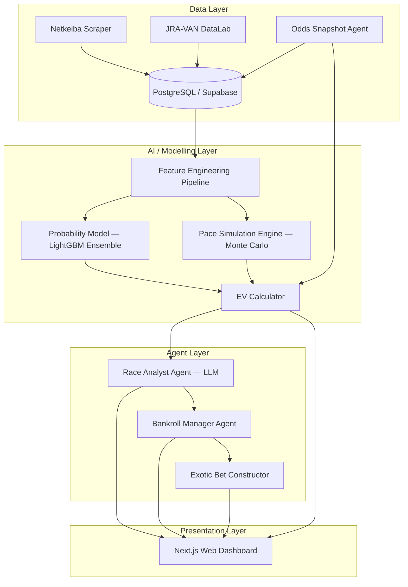
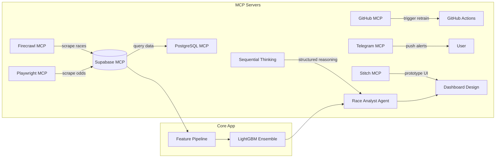

# UmaEdge — AI-Powered Japanese Horse Racing Intelligence Platform

## Overview

An agentic AI system that ingests structured and unstructured Japanese horse racing data (JRA/NAR), models true win/place probabilities, identifies positive expected-value (EV) bets against public parimutuel odds, and presents actionable intelligence through a polished web dashboard. The system is designed as a **research-first intelligence platform** — not an auto-execution engine — to stay on the right side of JRA terms of service and Japanese gambling regulations.

> [!IMPORTANT]
> The system is explicitly designed as a **decision-support tool**, not an automated betting bot.  
> Bet placement remains manual to respect JRA ToS and legal constraints.

---

## Architecture



---

## Phase 1 — Data Foundation (Weeks 1–3)

The prerequisite for everything. Build a comprehensive, clean race database from public sources.

### 1.1 Data Scraper — Netkeiba

#### [NEW] [scraper/netkeiba.py](file:///Users/ryfei.wang/Documents/horsebet/scraper/netkeiba.py)

Selenium-based scraper that collects historical and upcoming race data from `netkeiba.com`. Targets:

| Data Type | Source Page | Fields |
|---|---|---|
| Race cards | `/race/{race_id}` | Date, course, distance, surface, weather, going, entries |
| Horse profile | `/horse/{horse_id}` | Bloodline (sire/dam/broodmare sire), age, sex, owner, trainer, stable |
| Past performances | `/horse/{horse_id}` | Finish pos, margin, time, sectional (上がり3F), weight, jockey, draw, class |
| Jockey stats | `/jockey/{jockey_id}` | Win%, place%, recent form |
| Trainer stats | `/trainer/{trainer_id}` | Win%, place%, strike rate by class |
| Odds snapshots | `/odds/{race_id}` | Win, place, exacta, trifecta, trio odds at multiple timestamps |

- Uses Selenium + `undetected_chromedriver` with randomised delays (2–5s) to respect rate limits
- Stores raw HTML in `data/raw/` for reprocessing; parsed data goes straight to DB
- Backfill: start with **3 years** of JRA Grade-race data (~3,000 races, ~40k runner rows)
- Incremental: cron job scrapes upcoming race cards + results each weekend

#### [NEW] [scraper/jra_van.py](file:///Users/ryfei.wang/Documents/horsebet/scraper/jra_van.py)

Optional integration with **JRA-VAN DataLab** (JV-Link API, Windows-only COM interface).  
If subscribed, this provides official sectional times, training times (調教), and real-time odds — higher quality than scraped data.

- Wrapper runs on a Windows VM or via Wine
- Exports to CSV → ingested by the same pipeline

#### [NEW] [scraper/odds_watcher.py](file:///Users/ryfei.wang/Documents/horsebet/scraper/odds_watcher.py)

Lightweight daemon that snapshots odds every **5 minutes** from race card publication to 2 minutes before post time.

- Captures odds movement curve (early fan money → late smart money)
- Stores as time-series in `odds_snapshots` table

---

### 1.2 Database Schema

#### [NEW] [migrations/001_initial_schema.sql](file:///Users/ryfei.wang/Documents/horsebet/migrations/001_initial_schema.sql)

PostgreSQL schema on **Supabase**, designed for analytical queries:

```sql
-- Core entities
horses        (id, name, name_jp, sex, birth_year, sire_id, dam_id, broodmare_sire_id, trainer_id, owner, ...)
jockeys       (id, name, name_jp, win_rate, place_rate, ...)
trainers      (id, name, name_jp, stable, win_rate, ...)
courses       (id, name, surface, direction, inner_outer, ...)

-- Race data
races         (id, date, course_id, race_number, distance, surface, going, class, grade, weather, ...)
entries       (id, race_id, horse_id, jockey_id, draw, weight_carried, horse_weight, horse_weight_change, ...)
results       (id, entry_id, finish_pos, margin, time_secs, last_3f_secs, first_3f_secs, corner_positions, ...)

-- Odds time-series
odds_snapshots (id, race_id, timestamp, bet_type, combination, odds_value, pool_size, ...)

-- Model outputs
predictions   (id, race_id, entry_id, model_version, win_prob, place_prob, created_at)
value_bets    (id, race_id, entry_id, bet_type, model_prob, market_prob, ev, kelly_fraction, recommended_stake, ...)

-- Bankroll tracking
bankroll_log  (id, date, race_id, bet_type, stake, payout, profit, running_balance, ...)
```

- Row-Level Security enabled on `bankroll_log` (private to user)
- Indexes on `(race_id, horse_id)`, `(date, course_id)`, `(horse_id, date)` for fast lookups

---

## Phase 2 — Feature Engineering & Modelling (Weeks 3–6)

### 2.1 Feature Pipeline

#### [NEW] [models/features.py](file:///Users/ryfei.wang/Documents/horsebet/models/features.py)

Transforms raw DB rows into model-ready feature vectors. ~80–120 features per runner:

| Category | Features | Rationale |
|---|---|---|
| **Speed** | Best time at distance, last 3F avg, time vs class avg, Beyer-style speed figure | Core performance signal |
| **Form** | Weighted recent-5 finish %, days since last run, class change (up/down), win streak | Momentum / fitness |
| **Draw** | Gate number, historical draw bias at course×distance×surface | Positional advantage |
| **Weight** | Carried vs optimal, horse weight change from last run | Fitness proxy |
| **Jockey** | Win% overall, win% at course, win% at distance, jockey change flag | Rider skill signal |
| **Trainer** | Win%, place%, first-time blinkers %, stable form trajectory | Stable intent |
| **Bloodline** | Sire win% at distance, dam sire win% on surface, inbreeding coeff | Distance/surface suitability |
| **Pace** | Early pace proxy (avg first corner position), closing speed delta | Race shape |
| **Class** | Class index (G1=1 → maiden=10), class relative to career peak | Competition strength |
| **Odds** | Morning line, odds rank, odds movement slope (early→late) | Market intelligence |

- All features normalised per-race (z-score relative to field) so models see **relative** strengths
- Rolling windows: 3-race, 5-race, 10-race, lifetime

#### [NEW] [models/pace_sim.py](file:///Users/ryfei.wang/Documents/horsebet/models/pace_sim.py)

Monte Carlo race simulation engine:

1. Estimate each horse's **early speed** (first 600m proxy from corner positions)
2. Classify running style: 逃げ (front-runner), 先行 (stalker), 差し (closer), 追込 (deep closer)
3. Simulate 10,000 race scenarios varying:
   - Which horse takes the lead
   - Pace tempo (fast/moderate/slow)
   - Energy depletion curves
4. Output: P(win) and P(top-3) per horse conditioned on pace scenario

This is the **highest-alpha feature** — retail bettors badly underweight pace dynamics.

### 2.2 Prediction Model

#### [NEW] [models/train.py](file:///Users/ryfei.wang/Documents/horsebet/models/train.py)

Ensemble probability model:

```
Model 1: LightGBM (multiclass — finish position)
Model 2: XGBoost (binary — win/no-win)
Model 3: Neural net (simple MLP — calibrated probability)

Final: weighted average → calibrated P(win), P(place)
```

- Train on 3 years of data, validate on last 6 months
- **Calibration**: Platt scaling to ensure outputted probabilities are well-calibrated
- Target metric: **log-loss** (not accuracy — we need probability quality, not pick accuracy)
- SHAP values stored for explainability in the dashboard

#### [NEW] [models/backtest.py](file:///Users/ryfei.wang/Documents/horsebet/models/backtest.py)

Historical EV backtesting engine:

- For each past race: compare model P(win) vs closing odds implied probability
- Flag all bets where `model_prob > implied_prob + margin`
- Simulate flat-bet and Kelly-bet P&L over time
- Key outputs: ROI%, hit rate, max drawdown, Sharpe ratio of daily returns

> [!WARNING]
> A model that "predicts winners" at 30% accuracy can still be **negative EV** after JRA's ~25% take rate.  
> The backtest must prove **probability calibration + positive EV after take**, not just accuracy.

---

## Phase 3 — Agent Layer (Weeks 6–9)

### 3.1 Race Analyst Agent

#### [NEW] [agents/race_analyst.py](file:///Users/ryfei.wang/Documents/horsebet/agents/race_analyst.py)

LLM-powered agent (Gemini / GPT-4o) that generates human-readable race analysis:

**Input**: Feature vector, pace sim output, odds movement, model probabilities  
**Output**: Natural-language race preview in Japanese + English, including:
- 展開予想 (pace scenario forecast)
- 注目馬 (horses to watch) with reasoning
- Value plays with EV breakdown
- Risk factors (weather, draw, first-time conditions)

Uses structured prompting with function-calling to pull data from the DB on demand.

### 3.2 Bankroll Manager Agent

#### [NEW] [agents/bankroll.py](file:///Users/ryfei.wang/Documents/horsebet/agents/bankroll.py)

Automated bankroll sizing agent:

- Implements **fractional Kelly criterion** (default: quarter-Kelly for safety)
- Accounts for correlation between bets in the same race
- Daily exposure cap (e.g., max 5% of bankroll per race day)
- Drawdown circuit-breaker: halve stakes after 15% drawdown
- Tracks running P&L and adjusts dynamically

### 3.3 Exotic Bet Constructor

#### [NEW] [agents/exotic_bets.py](file:///Users/ryfei.wang/Documents/horsebet/agents/exotic_bets.py)

Optimises 三連複 / 三連単 / ワイド ticket construction:

1. From pace sim, get joint probability distribution over all finish permutations
2. Compare to pool odds for each combination
3. Under a budget constraint (e.g., ¥5,000), find the optimal set of tickets that maximises expected profit
4. Uses integer programming (PuLP / OR-Tools) to solve the ticket selection problem

---

## Phase 4 — Web Dashboard (Weeks 8–11)

### 4.1 Next.js Frontend

#### [NEW] [web/](file:///Users/ryfei.wang/Documents/horsebet/web/)

Premium dark-mode dashboard built with **Next.js + React**:

| Page | Content |
|---|---|
| **Dashboard** | Today's races, top value bets, bankroll status, daily P&L chart |
| **Race Card** | Per-race view: field analysis, probability table, pace scenario viz, odds movement chart, AI analyst commentary |
| **Backtest** | Historical P&L curve, ROI by month/course/class, model calibration plot |
| **Bankroll** | Running balance chart, bet log, Kelly fraction breakdown, risk metrics |
| **Settings** | Model parameters, bankroll config, notification preferences |

Design system:
- Dark mode with neon accent palette (racing green / gold / electric blue)
- Glassmorphism cards with subtle micro-animations
- Mermaid-style race flow diagrams for pace visualisation
- Responsive: desktop-first but mobile-usable on race day

#### [NEW] [web/app/api/](file:///Users/ryfei.wang/Documents/horsebet/web/app/api/)

Next.js API routes that query Supabase and invoke model/agent pipelines.

### 4.2 Backend API

#### [NEW] [api/main.py](file:///Users/ryfei.wang/Documents/horsebet/api/main.py)

FastAPI backend serving:
- `/races` — upcoming and past race data
- `/predictions/{race_id}` — model outputs + EV flags
- `/analysis/{race_id}` — LLM race preview
- `/bankroll` — balance, log, stats
- `/exotic/{race_id}` — optimal ticket suggestions
- `/backtest` — historical performance metrics

---

## Phase 5 — Polish & Go-Live (Weeks 11–13)

### 5.1 Notifications

#### [NEW] [agents/notifier.py](file:///Users/ryfei.wang/Documents/horsebet/agents/notifier.py)

- LINE / Telegram bot that pushes high-EV alerts on race day morning
- Summary of today's plays with stake sizing

### 5.2 Continuous Learning

- After each race weekend, results flow back → retrain model weekly
- Track model drift: alert if calibration degrades
- A/B test model versions (shadow mode)

---

## Tech Stack Summary

| Layer | Technology |
|---|---|
| Scraping | Python, Selenium, `undetected_chromedriver`, BeautifulSoup |
| Database | Supabase (PostgreSQL), Row-Level Security |
| Feature Engineering | Python, Pandas, NumPy |
| ML Models | LightGBM, XGBoost, scikit-learn, PyTorch (MLP) |
| Pace Simulation | Python, NumPy (Monte Carlo) |
| Optimisation | PuLP / Google OR-Tools (exotic bet construction) |
| LLM Agent | Gemini API / OpenAI API, LangChain or raw function-calling |
| Backend API | FastAPI, Pydantic, SQLAlchemy |
| Frontend | Next.js 14, React, CSS (dark glassmorphism design) |
| Deployment | Vercel (frontend), Render / Railway (API), Supabase (DB) |
| Scheduling | GitHub Actions or `cron` for weekly scrape + retrain |
| Notifications | LINE Messaging API / Telegram Bot API |

---

## MCP Servers — Recommended for This Project

MCP (Model Context Protocol) servers extend AI agent capabilities by providing standardised access to external tools and services. Below are the servers most relevant to UmaEdge, grouped by role.

### ✅ Already Connected

| Server | Role | How It Helps |
|---|---|---|
| **Supabase MCP** | Database management | Apply migrations, execute SQL, manage RLS policies, generate TypeScript types, deploy Edge Functions — all without leaving the IDE. Already handles our entire DB layer. |
| **Stitch MCP** | UI design & prototyping | Generate and iterate on screen designs for the dashboard before writing code. Useful for rapid visual prototyping of the race card view, bankroll page, etc. |


### Integration Architecture



### Setup Priority

For the **MVP**, install in this order:

1. **Firecrawl MCP** — gets the data pipeline running fast
2. **Playwright MCP** — fallback for JavaScript-heavy pages Firecrawl can't handle
3. **PostgreSQL MCP** — ad-hoc querying during model development
4. **GitHub MCP** — automate the weekly retrain/scrape cron

The rest can be added incrementally as the project matures.

---

## Risks & Mitigations

| Risk | Impact | Mitigation |
|---|---|---|
| Netkeiba anti-bot measures | Data pipeline breaks | Randomised delays, `undetected_chromedriver`, JRA-VAN fallback |
| Model overfitting | False positive EV | Walk-forward validation, calibration checks, conservative Kelly fraction |
| 25% take rate kills edge | Negative ROI | Focus on exotic markets (lower efficiency), pace-shape alpha, strict EV threshold |
| Parimutuel self-impact | Edge eroded at scale | Keep stakes small (< ¥50k per bet), focus on large-pool races |
| Legal / ToS risk | Account suspension | No auto-execution; decision-support only; manual bet placement |
| Odds data staleness | Wrong EV calc | Real-time snapshots every 5 min; final EV check uses last available odds |

---

## Verification Plan

### Automated Tests

#### Phase 1 — Data layer
```bash
# Run scraper on a single known race (stored fixture) and compare to expected output
pytest tests/test_scraper.py -v

# Validate schema migration applies cleanly
supabase db push --dry-run
```

#### Phase 2 — Model
```bash
# Feature pipeline: unit tests with known race → known feature vector
pytest tests/test_features.py -v

# Model training: smoke test on small subset, check calibration metric
pytest tests/test_model.py -v

# Backtest: verify P&L calculation on fixture data
pytest tests/test_backtest.py -v
```

#### Phase 3 — Agents
```bash
# Bankroll agent: unit test Kelly sizing with known inputs
pytest tests/test_bankroll.py -v

# Exotic bet constructor: verify optimal ticket under toy scenario
pytest tests/test_exotic.py -v
```

#### Phase 4 — Web
```bash
# Next.js build check
cd web && npm run build

# API endpoint smoke tests
pytest tests/test_api.py -v
```

### Manual Verification

1. **Backtest sanity check** — Run the backtester on 6 months of data and manually verify that 5 randomly selected "value bet" flags genuinely had model_prob > implied_prob
2. **Race preview review** — Generate AI analysis for 3 upcoming races and have the user read for coherence, accuracy of facts, and quality of pace scenario reasoning
3. **Dashboard walkthrough** — Open the web dashboard in a browser, navigate all pages, verify data loads correctly, charts render, and the design matches the premium aesthetic spec
4. **Paper trading** — For 2 weekends of live racing, log the system's recommended bets (without placing real money) and compare outcomes to predictions

---

## Minimum Viable Product (MVP) Scope

For a first working demo, focus on:

1. ✅ Scraper for ~500 recent JRA races (G1–G3)
2. ✅ Feature pipeline (speed, form, draw, jockey — ~30 features)
3. ✅ Single LightGBM win-probability model
4. ✅ Backtest showing ROI on historical data
5. ✅ Simple dashboard: race card + probability table + EV flags
6. ❌ Skip: exotic bets, bankroll agent, LLM analyst, notifications

This gets you from idea → testable hypothesis in **~3 weeks**.

---

## 2025 Model Evaluation Results

> Evaluation run on 2025-02-25. Trained on 2024 data, validated on 2025 holdout races scraped from netkeiba.com.

### Data Summary

| Year | Races | Entries | Results | Source |
|------|-------|---------|---------|--------|
| 2024 | 181 | 2,332 | 2,312 | Sapporo, Hakodate, Fukushima, Niigata, Tokyo, Nakayama, Chukyo, Kyoto, Hanshin, Kokura |
| 2025 | 100 | 1,209 | 1,196 | Sapporo, Hakodate (Jan 1–2) |
| **Total** | **281** | **3,541** | **3,508** | |

- Scrape command: `python -m scraper.batch_scrape --year 2025 --max-races 100`
- 100% success rate, 0 failures, 0 not-found

### Model Quality — 2025 Holdout

| Metric | LightGBM | XGBoost | Ensemble (0.55/0.45) |
|--------|:--------:|:-------:|:--------------------:|
| **Log-Loss** | 0.2351 | 0.2294 | **0.2305** |
| **AUC** | 0.8080 | 0.8217 | **0.8187** |
| **Brier** | 0.0666 | 0.0656 | **0.0656** |

- Training set: 2,332 entries (181 races, ≤2024), win rate 7.8%
- Validation set: 1,209 entries (100 races, 2025), win rate 8.3%
- LightGBM early-stopped at 32 iterations, XGBoost at 88

### Calibration

| Predicted P(win) | Actual Win Rate | n |
|:-:|:-:|:-:|
| 4% | 3.2% | 936 |
| 14% | 16.7% | 132 |
| 25% | 34.5% | 87 |
| 34% | 30.6% | 36 |
| 44% | 33.3% | 15 |
| 53% | 66.7% | 3 |

Well-calibrated in the 0–15% range (where most entries fall). Slightly overconfident in the 20–40% mid-range — model predicts higher win probability than observed.

### Feature Importance (Top 15 by LightGBM Gain)

| # | Feature | Gain |
|---|---------|-----:|
| 1 | `odds_win` | 1,972 |
| 2 | `log_odds_z` | 294 |
| 3 | `odds_win_z` | 293 |
| 4 | `log_odds` | 278 |
| 5 | `horse_weight_z` | 247 |
| 6 | `horse_weight_change_z` | 227 |
| 7 | `post_position_z` | 185 |
| 8 | `sex_code_z` | 184 |
| 9 | `weight_carried_z` | 184 |
| 10 | `horse_weight` | 180 |
| 11 | `popularity_z` | 151 |
| 12 | `distance` | 129 |
| 13 | `draw_z` | 121 |
| 14 | `age_z` | 93 |
| 15 | `popularity` | 88 |

> [!WARNING]
> `odds_win` dominates with 6.7× more importance than the next feature.  
> The model is **heavily relying on market consensus** rather than finding independent alpha. This is the primary reason the backtest shows negative ROI — you can't consistently beat the market using the market's own odds as the main signal.

### Backtest Results (5% EV Threshold, Quarter-Kelly)

| Metric | Value |
|--------|------:|
| Races analysed | 100 |
| Bets placed | 32 |
| Hit rate | 15.6% |
| Total staked | ¥71,963 |
| Total payout | ¥58,992 |
| **Total profit** | **¥-12,971** |
| **ROI** | **-18.0%** |
| Max drawdown | ¥29,985 (25.6%) |
| Sharpe ratio | -20.61 |

#### Notable Wins

| Horse | P(win) | Odds | EV | Payout |
|-------|:------:|:----:|:--:|-------:|
| アンティミスト | 47.3% | 3.9× | +0.22 | +¥19,344 ✅ |
| シンヒダカゴールド | 34.9% | 4.0× | +0.10 | +¥13,256 ✅ |
| レッドスティンガー | 46.7% | 2.9× | +0.12 | +¥8,031 ✅ |

### Recommendations for Next Iteration

| Priority | Action | Rationale |
|----------|--------|-----------|
| 🔴 High | **Train without odds features** — build a separate model excluding `odds_win`/`log_odds` | Forces independent signal discovery; current model is just mirroring the market |
| 🔴 High | **More training data** — scrape 2–3 full years (2022–2024) | 181 training races is too few for a 96-feature model; more data → better generalisation |
| 🟡 Med | **Fix odds scraping** — some entries have `NaN` odds, causing flat ¥1,000 bets | ~10 bets placed with missing odds diluted results |
| 🟡 Med | **Higher EV threshold** — try 10–15% to be more selective | Fewer but higher-conviction bets |
| 🟡 Med | **Incorporate pace simulation** — Monte Carlo pace sim exists in `models/pace_sim.py` but isn't used | Unique alpha source that retail bettors don't model |
| 🟢 Low | **Add rolling jockey/trainer stats** as features | More form signals beyond horse history |
| 🟢 Low | **Cross-validate** rather than single time-based split | More robust metric estimates |

### Running the Evaluation

```bash
# Re-run the full evaluation
python -m models.test_2025

# With higher EV threshold
python -m models.test_2025 --ev-threshold 0.10

# Save results to CSV
python -m models.test_2025 --output /tmp/backtest_2025.csv
```
